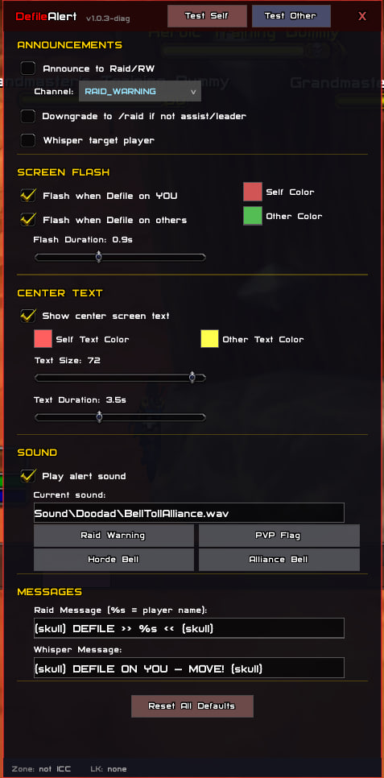

# DefileAlert

**Instant Defile target detection for The Lich King encounter in Icecrown Citadel.**

World of Warcraft 3.3.5a (build 12340) · Lua 5.1 · Zero dependencies

---

## What It Does

DefileAlert announces who the Lich King is casting Defile on **as fast as the WoW client physically allows** — same frame as the server packet, ~1.5μs of Lua overhead.

When Defile is detected:
- **Screen flash** — full-screen color overlay (separate colors for self/others)
- **Center text** — large customizable text alert
- **Sound** — selectable alert sound
- **Raid announcement** — automatic message to RAID_WARNING/RAID
- **Whisper** — warns the targeted player directly



## Demo (click to open video)

[](https://www.youtube.com/watch?v=FGCChzBoVuM)

## Detection Architecture

Triple-path detection ensures zero missed Defiles:

```
┌─────────────────────────────────────────────────────────┐
│ PRIMARY: UNIT_SPELLCAST_START                           │
│   Fires directly from packet handler                    │
│   Server provides unitID → ReadTargetName() → instant   │
│   Latency: same frame as server packet (~1.5μs Lua)     │
├─────────────────────────────────────────────────────────┤
│ BACKUP: COMBAT_LOG_EVENT_UNFILTERED                     │
│   Fires if LK not in boss frames (rare edge case)       │
│   Extracts destName from CLEU or finds LK via scan      │
│   Latency: same frame, +1-2μs for unit lookup           │
├─────────────────────────────────────────────────────────┤
│ FALLBACK: UNIT_TARGET + 150ms timeout                   │
│   Last resort if both paths fail to resolve target      │
│   Forces FindLKUnit scan after timeout                  │
│   Latency: +150ms worst case                            │
└─────────────────────────────────────────────────────────┘
```

LK unit resolution priority:
1. **Cached unitID** — from previous detection (instant)
2. **Boss frames** — `boss1`..`boss4` (automatic, no setup needed)
3. **Focus** — if you manually focus LK
4. **Target** — if you're targeting LK
5. **Raid targets** — `raid1target`..`raid40target` (full scan)

**You do not need to focus or target the Lich King.** Boss frames are populated automatically by the server.

---

## Installation

1. Download or clone this repository
2. Copy the `DefileAlert` folder to `World of Warcraft/Interface/AddOns/`
3. Restart WoW or `/reload`

```
World of Warcraft/
└── Interface/
    └── AddOns/
        └── DefileAlert/
            ├── DefileAlert.toc
            ├── DefileAlert.lua
            └── DefileAlertOptions.lua
```

---

## Usage

### Slash Commands

| Command | Action |
|---|---|
| `/da` | Open configuration panel |
| `/da config` | Open configuration panel |
| `/da test` | Test alert (self) |
| `/da testother` | Test alert (other player) |
| `/da status` | Show current status |
| `/da help` | List all commands |

### Configuration Panel

Type `/da` to open the GUI. All settings are saved between sessions.

**Announcements**
- Toggle raid/RW announcements
- Channel selection (RAID_WARNING, RAID, SAY, YELL)
- Auto-downgrade to /raid if not raid assist/leader
- Toggle whisper to targeted player

**Screen Flash**
- Separate toggle for self/others
- Custom colors with alpha (opacity) via color picker
- Adjustable flash duration

**Center Text**
- Toggle on/off
- Separate colors for self/others
- Adjustable text size (20-72)
- Adjustable display duration

**Sound**
- Toggle on/off
- Four preset sounds (Raid Warning, PVP Flag, Horde Bell, Alliance Bell)
- Custom sound file path support

**Messages**
- Customizable raid announcement text
- Customizable whisper text
- `%s` placeholder for player name in raid message

---

## Spell IDs Tracked

| Spell ID | Variant |
|---|---|
| 72762 | Defile 10N |
| 73708 | Defile 25N |
| 73709 | Defile 10H |
| 73710 | Defile 25H |

---

## Performance

- **Zero CPU cost outside ICC** — events only registered inside Icecrown Citadel
- **~1.5μs per detection** — all globals cached as locals, spell IDs checked via hash table lookup
- **No polling** — pure event-driven architecture
- **2-second debounce** — prevents duplicate announcements
- **Lazy GUI loading** — options panel only built on first open

---

## Technical Details

- Written for WoW 3.3.5a (Interface 30300, build 12340)
- Pure Lua 5.1 — no external libraries or dependencies
- Native WoW frames for GUI — no Ace3, no LibStub
- SavedVariables for persistent settings
- Blizzard Interface Options integration (ESC → Interface → AddOns → DefileAlert)

---

## File Structure

```
DefileAlert/
├── DefileAlert.toc            # Addon metadata
├── DefileAlert.lua            # Core detection engine + announce logic
├── DefileAlertOptions.lua     # GUI configuration panel
└── README.md                  # This file
```

---

## SavedVariables

Settings are stored in `DefileAlertDB` (WTF folder). Delete this file to reset all settings, or use the "Reset All Defaults" button in the config panel.

---

## Changelog

### v1.0 (Release)
- Triple-path Defile detection (UNIT_SPELLCAST_START → CLEU → UNIT_TARGET)
- Full GUI configuration panel
- Custom color picker with alpha support
- Sound preset selection
- Inline reset confirmation
- Blizzard Interface Options integration
- Time-guarded detected flag (prevents missed announcements)
- CLEU destructure optimization (eliminates redundant select() calls)
- CLEU destName extraction (zero-lookup announce when available)

---

## License

MIT

---

## Author

**Suprematist**